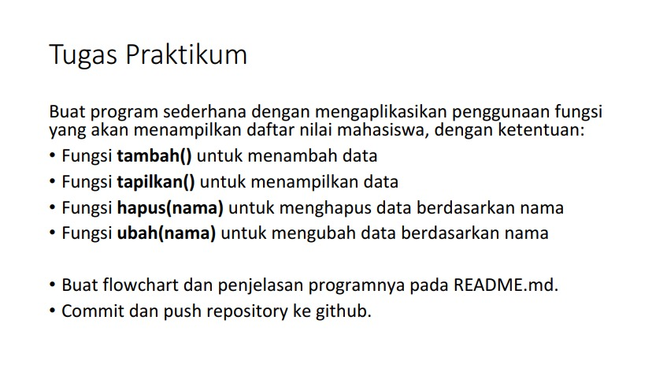
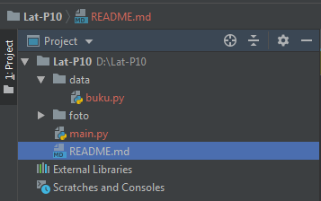
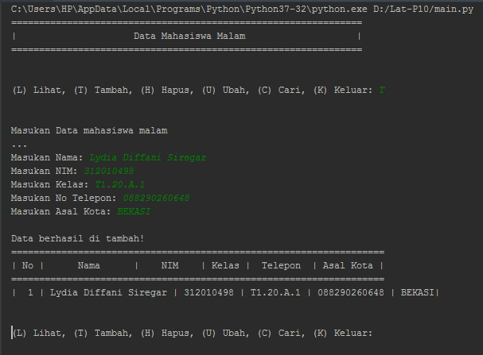
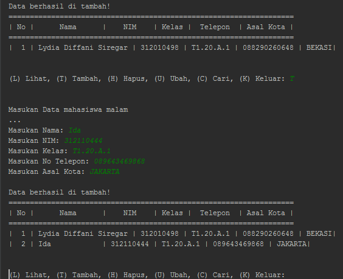
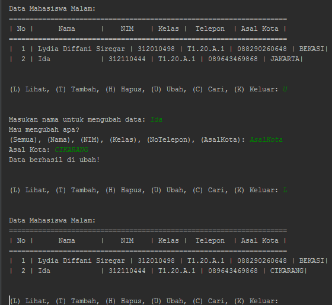
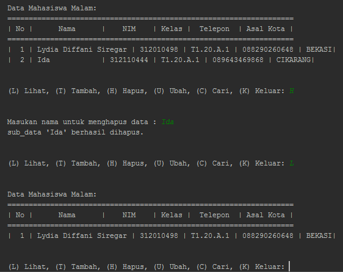

# Praktikum-10
Repository ini dibuat untuk memenuhi tugas di pertemuan-10 <br>
<pre>
Nama    : Lydia Diffani Siregar
Kelas   : TI.20.A1
NIM     : 312010498
Dosen   : Agung Nugroho S.Kom, M.Kom
</pre>
***

**Berikut ini tugas yang diberikan oleh dosen saya :** <br>

<div align="center">

</div> <br>

Untuk membuat task diatas saya dengan source code sebagai berikut: <br>
**Data** & **Main Script**
<br>
<br>
**Untuk membuat file **Data** tersebut saya menggunakan source code dibawah ini :** <br>

```
from data import buku
print("===============================================================")
print("|                     Data Mahasiswa Malam                    |")
print("===============================================================")

buku.add()
buku.show()
```

Kemudian kita *save* di folder sendiri, disini saya menyimpan file **buku** kedalam folder **Data** dan saya simpan dengan file name *book*. <br>

<div align="center">

</div> <br>

Source Code diatas berfungi sebagai berbagai *action syntax* yang nanti akan di run di file **Main Script**.
<br>
**Kemudian untuk file **Main Script** nya sendiri saya menggunakan source code sebagai berikut :**

```
data = []
data = {}

def add():
    while True:
        print("\n")
        menu = input("(L) Lihat, (T) Tambah, (H) Hapus, (U) Ubah, (C) Cari, (K) Keluar: ")
        print("\n")

        # Keluar
        if menu.lower() == 'k':
            break

        # Lihat
        elif menu.lower() == 'l':
            print("Data Mahasiswa Malam:")
            print("===================================================================")
            print("| No |      Nama      |    NIM    | Kelas |  Telepon  | Asal Kota |")
            print("===================================================================")
            no = 1
            for tabel in data.values():
                print("| {0:2} | {1:14} | {2:9} | {3:5} | {4:5} | {5:5}|".format
                      (no, tabel[0],
                       tabel[1], tabel[2],
                       tabel[3], tabel[4]))
                no += 1

        # Tambah
        elif menu.lower() == 't':
            print("Masukan Data mahasiswa malam")
            print("...")
            nama = input("Masukan Nama: ")
            nim = input("Masukan NIM: ")
            Kelas = input("Masukan Kelas: ")
            NoTelepon = input("Masukan No Telepon: ")
            AsalKota = input("Masukan Asal Kota: ")
            data[nama] = [nama, nim, Kelas, NoTelepon, AsalKota]
            print('\nData berhasil di tambah!')
            print("===================================================================")
            print("| No |      Nama      |    NIM    | Kelas |  Telepon  | Asal Kota |")
            print("===================================================================")
            no = 1
            for tabel in data.values():
                print("| {0:2} | {1:14} | {2:9} | {3:5} | {4:5} | {5:5}|".format
                      (no, tabel[0],
                       tabel[1], tabel[2],
                       tabel[3], tabel[4]))
                no += 1

        # Ubah
        elif menu.lower() == 'u':
            nama = input("Masukan nama untuk mengubah data: ")
            if nama in data.keys():
                print("Mau mengubah apa?")
                sub_data = input("(Semua), (Nama), (NIM), (Kelas), (NoTelepon), (AsalKota): ")
                if sub_data.lower() == "semua":
                    print("==========================")
                    print("Ubah data {}.".format(nama))
                    print("==========================")
                    data[nama][1] = int(input("Ubah NIM:"))
                    data[nama][2] = input("Ubah Kelas: ")
                    data[nama][3] = input("Ubah No Telepon: ")
                    data[nama][4] = input("Ubah Asal Kota: ")
                    print("\nBerhasil ubah data!")
                    print("_______________________")
                    print("| No |      Nama      |    NIM    | Kelas |  Telepon  | Asal Kota |")
                    print("===================================================================")
                    no = 1
                    for tabel in data.values():
                        print("| {0:2} | {1:14} | {2:9} | {3:5} | {4:5} | {5:5}|".format
                              (no, tabel[0],
                               tabel[1], tabel[2],
                               tabel[3], tabel[4]))
                        no += 1
                elif sub_data.lower() == "nim":
                    data[nama][1] = input("NIM:")
                    print('Data berhasil di ubah!')
                elif sub_data.lower() == "kelas":
                    data[nama][2] = input("Kelas: ")
                    print('Data berhasil di ubah!')
                elif sub_data.lower() == "notelepon":
                    data[nama][3] = input("No Telepon: ")
                    print('Data berhasil di ubah!')
                elif sub_data.lower() == "asalkota":
                    data[nama][4] = input("Asal Kota: ")
                    print('Data berhasil di ubah!')
                else:
                    print("menu tidak ditemukan.")

            else:
                print("'{}' tidak ditemukan.".format(nama))

        # Cari
        elif menu.lower() == 'c':
            print("Mencari data: ")
            print("=================================================")
            nama = input("Masukan nama untuk mencari data: ")
            if nama in data.keys():
                print('\nResult')
                print("Nama: {0}\nNIM : {1}\nKelas: {2}\nNo Telepon: {3}\nAsal Kota: {4}"
                      .format(nama, data[nama][1],
                              data[nama][2], data[nama][3],
                              data[nama][4]))
            else:
                print("'{}' tidak ditemukan.".format(nama))

        # Hapus
        elif menu.lower() == 'h':
            nama = input("Masukan nama untuk menghapus data : ")
            if nama in data.keys():
                del data[nama]
                print("sub_data '{}' berhasil dihapus.".format(nama))
            else:
                print("'{}' tidak ditemukan.".format(nama))

        else:
            print("Something wrong,check again lur!")

def show():
    print("Data Mahasiswa Malam:")
    print("===================================================================")
    print("| No |      Nama      |    NIM    | Kelas |  Telepon  | Asal Kota |")
    print("===================================================================")
    no = 1
    for tabel in data.values():
        print("| {0:2} | {1:14} | {2:9} | {3:5} | {4:5} | {5:5}|".format
              (no, tabel[0],
               tabel[1], tabel[2],
               tabel[3], tabel[4]))
```              

**Kemudian setelah 2 file tersebut dibuat, lalu kita run. Maka akan menghasilkan output sebagai berikut:**
<div align="center">

</div> <br>

**Dan disitu kita punya 6 opsi:** <br>

**Lihat** <br>
**Tambah** <br>
**Hapus** <br>
**Ubah** <br>
**Cari** <br>
**Keluar** <br>

Mari kita coba opsi T (Tambah) dari source code **Book** diatas, maka output yang keluar adalah sebagai berikut : <br>

<div align="center">

</div> <br>

Berjalan sesuai dengan yang kita inginkan. <br>
<br>

**Sekarang kita akan mencoba opsi **Ubah**:** <br>

<div align="center">

</div> <br>

Data **Kelas** dari table sebelumnya berhasil kita ubah dengan opsi **Ubah**, Selanjutkan kita akan mencoba opsi **Hapus** : <br>
Berikut tampilan dari menu **Hapus** : <br>

<div align="center">

</div> <br>
<br>

Untuk opsi **Lihat** dan **Keluar** dua opsi tersebut akan menampilkan result table yang sudah kita isi dengan data, setelah melalui proses sebelumnya.

***
## Penjelasan

- `from data import book` = Syntax ini berfungsi untung *menginport* file *book* dari folder data.

- `data={}` : Ini digunakan untuk menampung list dengan format **dictionary**. <br>

- `menu = input("(L) Lihat, (T) Tambah, (H) Hapus, (U) Ubah, (C) Cari, (K) Keluar: ")` : Untuk menambah opsi **Tambah/Ubah/Hapus/Lihat/Cari/Keluar** dari variable menu. <br>

- `break` : untuk menghentikan seluruh proses yang berjalan. <br>

- `book.add()` : untuk summon dan run perintah dari sumber `book`

- `book.show()` : untuk menampilkan sub menu `show` dari sumber `book` <br>

- `sub_data = input("(Semua), (Nama), (NIM), (Kelas), (NoTelepon), (AsalKota): ")` Untuk menambah pilihan opsi **Nama/NIM/Kelas/No Telepon/Asal Kota** dari variable opsi **Ubah**. <br>

***
**Sekian tugas saya untuk Repository ini, Terimakasih.**
<br>

